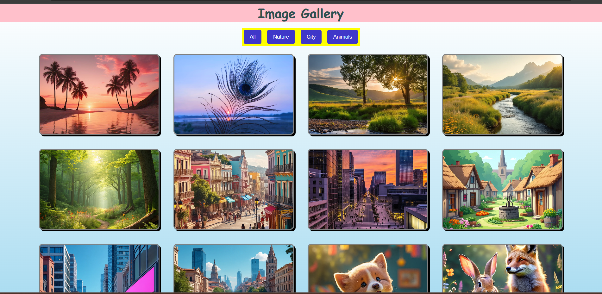
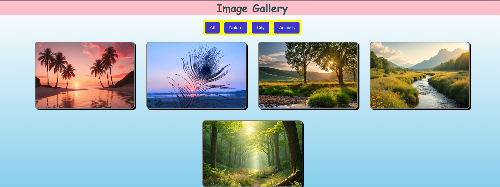
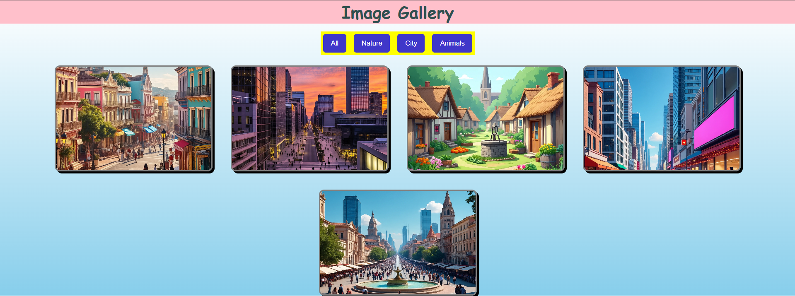

# Codealpha_Image_Gallery
Task 1 Image Gallery

This is a simple and responsive Image Gallery created using HTML, CSS, and JavaScript. The gallery allows users to browse through a collection of images and optional lightbox functionality.

🚀 Features
1. Responsive image grid layout
2. Lightbox preview (optional enhancement)
3. Clean and modern UI using CSS
4. Easy to click on images

🛠️ Technologies Used
HTML – for structure and layout
CSS – for styling and responsiveness
JavaScript – for interactive navigation

📸 Screenshot

💡 How to Use
Clone or download this repository.
Open the index.html file in your browser.
Click on an image to view it in large size (if lightbox is included).
Use arrow buttons to browse through images (if navigation is implemented).

📂 Project Structure
image-gallery/
├── index.html
├── style.css
├── script.js
├── Images/
│   ├── img1.jpg
│   ├── img2.jpg
│   └── ...
└── screenshot.png

📚 Learning Outcomes
Working with the DOM in JavaScript
Implementing event listeners and dynamic content
Designing responsive layouts with CSS
Creating an interactive image gallery UI
